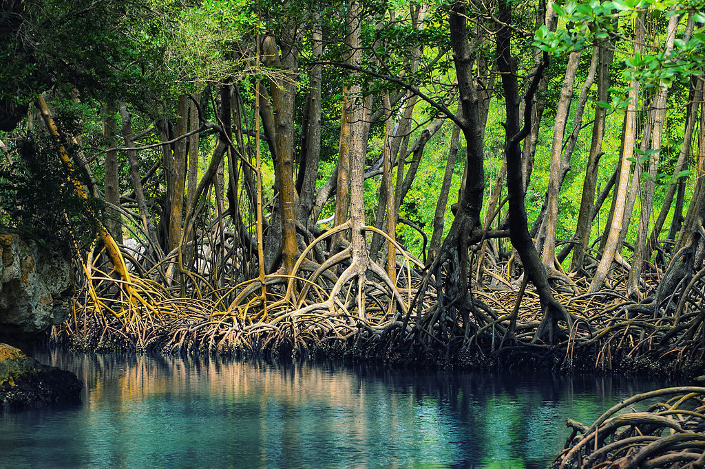
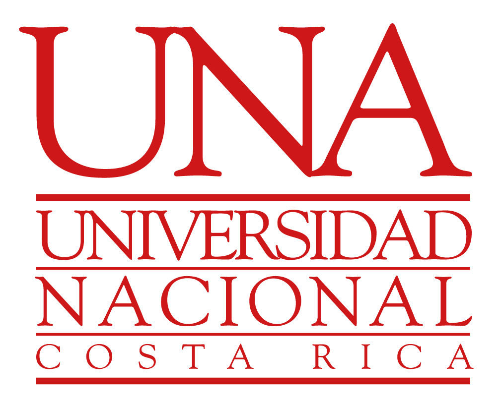

::::: hero-portada
::: hero-texto
# Nombre Apellido

## Estudiante de Bachillerato en Biología

Escuela de Ciencias Biológicas\
Universidad Nacional, Costa Rica

[Ver mi perfil](about.qmd){.btn-portada}\
[Explorar mi portafolio](portfolio.qmd){.btn-portada .btn-secundario}
:::

::: hero-imagen
{fig-alt="Imagen representativa de biodiversidad y trabajo científico"}
:::
:::::

::: bloque-bienvenida
## Bienvenido(a)

Este sitio web constituye mi **portafolio digital académico**, donde documentaré las prácticas de laboratorio, proyectos, análisis y productos desarrollados durante el curso **Ecología de Poblaciones y Comunidades**.

Este portafolio utiliza herramientas de ciencia reproducible como **R**, **Quarto**, **Git** y **GitHub**, permitiendo organizar y compartir mi trabajo de manera profesional.
:::

## Contenido del sitio

::::: tarjetas-inicio
::: tarjeta-inicio
### Perfil

Información personal, intereses académicos y experiencia.

[Ir al perfil →](about.qmd)
:::

::: tarjeta-inicio
### Portafolio

Registro de las prácticas, proyectos y productos desarrollados durante el semestre.

[Ver el portafolio →](portfolio.qmd)
:::
:::::

::: mensaje-final
> *La ciencia solo adquiere valor cuando puede ser comunicada y reproducida.*
:::

------------------------------------------------------------------------

## Herramientas y afiliación

Este portafolio fue desarrollado con herramientas de ciencia reproducible.

::: {.logos-portada}

{width=150}

{width=70}

{width=70}

:::

**Última actualización:** Agosto 2026
