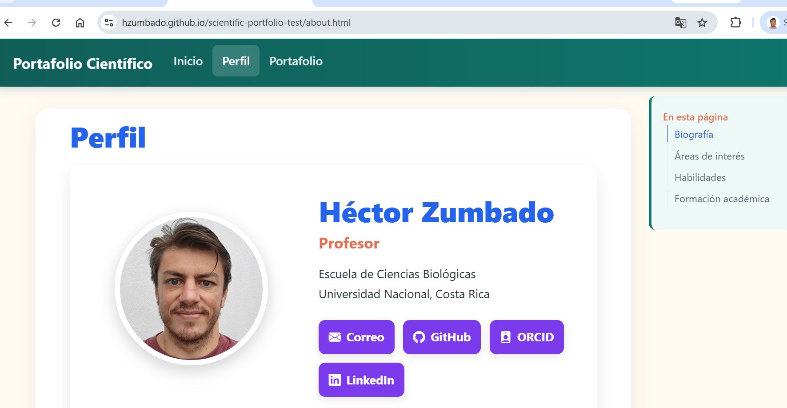

## Objetivo

Describa brevemente qué se pretende aprender o realizar en la práctica.

## Materiales y herramientas

- RStudio
- Quarto
- Git
- GitHub

## Procedimiento

Explique de forma ordenada los pasos realizados durante la práctica.

## Resultados

Incluya aquí los principales resultados obtenidos.

## Figuras y tablas

## Reflexión final

Responda brevemente:

- ¿Qué aprendí?
- ¿Qué dificultad encontré?
- ¿Cómo podría aplicar esta herramienta o conocimiento en otro contexto?
