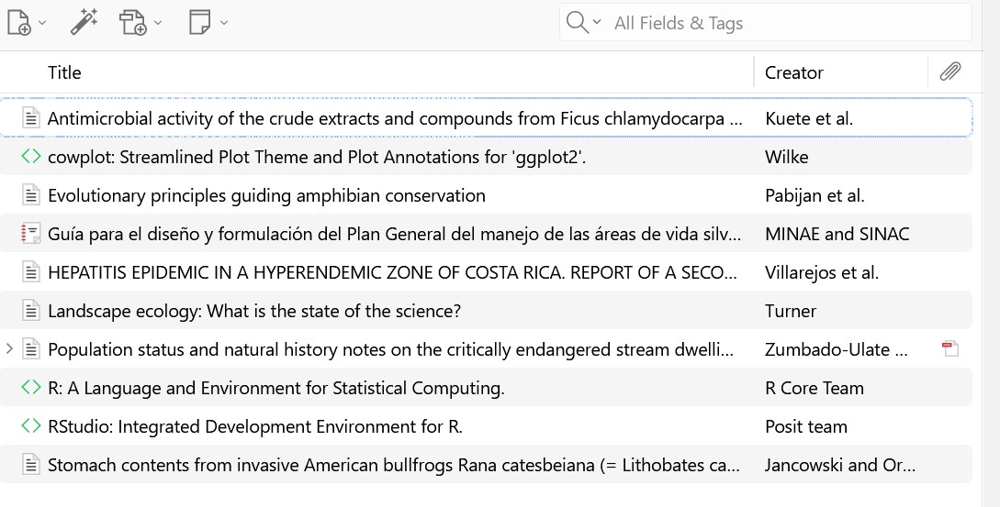

## Introducción

## Objetivo

## Metodología

## Resultados

amphibian conservation [@pabijan_evolutionary_2020]

|  |
|------------------------------------------------------------------------|
| Cuadro 1. Métodos utilizados para incorporar referencias bibliográficas a Zotero. |

| Método | ¿Cuándo utilizarlo? |
|------------------------------------|------------------------------------|
| DOI | Cuando la publicación tiene un DOI conocido |
| Archivo .RIS | Cuando la revista o base de datos permite exportar la referencia |
| Zotero Connector | Para capturar referencias directamente desde el navegador |
| Entrada Manual | Cuando la información no puede importarse automáticamente |

## Conclusiones

gfhdgf

## Referencias
